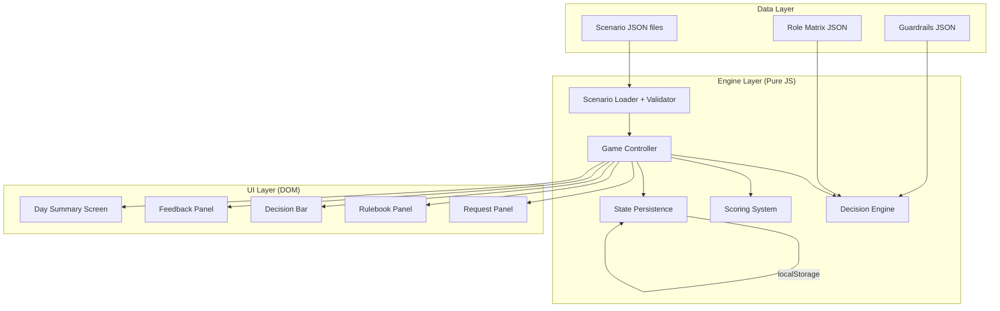

# Design Document: IAM Please

## Overview

IAM Please is a client-only, vanilla JS/HTML/CSS web game implementing a Papers, Please–style IAM access request approval workflow. The player reviews access request tickets and stamps them APPROVE or DENY based on a role matrix, ABAC tag rules, and guardrails. The game is data-driven: scenarios, roles, and rules are defined in JSON and validated against schemas. All state is managed client-side with localStorage persistence.

The architecture follows a clean separation between:

- **Data layer**: JSON schemas, scenario data, role/ABAC/guardrail configuration
- **Engine layer**: Decision engine, scoring system, game controller (pure logic, no DOM)
- **UI layer**: Vanilla HTML/CSS/JS rendering, keyboard handling, focus management

This separation ensures the decision engine and scoring logic are independently testable without DOM dependencies.

## Architecture



### Key Architectural Decisions

1. **No framework**: Vanilla JS with ES modules. Keeps the build toolchain minimal (just a dev server + test runner). The game is a state machine with a small number of screens — a framework would be overkill.

2. **Pure engine layer**: The Decision Engine, Scoring System, and Game Controller operate on plain JS objects with no DOM references. This makes them trivially unit-testable and property-testable.

3. **Data-driven content**: All scenarios, roles, ABAC rules, and guardrails are JSON files loaded at runtime. Adding new content requires no code changes.

4. **CSS-only visuals**: All "desk/paper/stamp" aesthetics are achieved with CSS (box shadows, borders, gradients, transforms). No external image assets needed.

## Components and Interfaces

### Decision Engine (`src/engine/decision-engine.js`)

The core logic module. Takes a request and the current rule set, returns a structured decision.

```javascript
/**
 * @param {Request} request - The access request to evaluate
 * @param {RoleMatrix} roleMatrix - Current role permissions
 * @param {ABACOverlay|null} abacOverlay - Active ABAC rules (null if not yet unlocked)
 * @param {Guardrail[]} guardrails - Active guardrails (empty if not yet unlocked)
 * @returns {DecisionResult} - { decision: 'APPROVE'|'DENY', reasonCode: string, explanation: string }
 */
function evaluate(request, roleMatrix, abacOverlay, guardrails) { }
```

Evaluation order (mirrors simplified IAM logic):

1. Check guardrails — if any explicit deny matches, return DENY immediately
2. Check ABAC overlay (if active) — if any tag constraint fails, return DENY
3. Check role matrix — if no explicit allow exists for role+action+resource+env, return DENY (implicit deny)
4. Check request quality — wildcards require break-glass conditions (ticket ID + time window)
5. If all checks pass, return APPROVE

### Scenario Loader (`src/engine/scenario-loader.js`)

Loads and validates scenario JSON against the schema.

```javascript
/**
 * @param {string} jsonString - Raw JSON string
 * @returns {Scenario} - Parsed and validated scenario object
 * @throws {ValidationError} - If JSON doesn't conform to schema
 */
function parseScenario(jsonString) { }

/**
 * @param {Scenario} scenario - A scenario object
 * @returns {string} - JSON string conforming to schema
 */
function printScenario(scenario) { }
```

### Scoring System (`src/engine/scoring.js`)

Pure function that computes score delta from a player decision vs expected.

```javascript
/**
 * @param {PlayerDecision} playerDecision - { decision, reasonCode }
 * @param {ExpectedOutcome} expected - { decision, reasonCode, explanation }
 * @param {Scenario} scenario - For context (data classification, environment)
 * @returns {ScoreEvent} - { scenarioId, decision, isCorrect, scoreDelta, ... }
 */
function computeScore(playerDecision, expected, scenario) { }
```

Scoring rules:

- Correct decision: +10
- Correct rationale code bonus: +3
- Dangerous false approval (prod + restricted/confidential, or wildcard): −15
- False denial: −5

### Game Controller (`src/engine/game-controller.js`)

Orchestrates the game flow: day loading, ticket progression, state transitions.

```javascript
class GameController {
  constructor(scenarios, roleMatrix, abacOverlay, guardrails, persistence) { }

  startDay(dayNumber) { }       // Load tickets for the day
  getCurrentTicket() { }         // Get current scenario
  submitDecision(decision, reasonCode) { } // Process player's stamp
  nextTicket() { }               // Advance to next ticket
  isDayComplete() { }            // Check if all tickets done
  getDaySummary() { }            // Get end-of-day results
  getGameState() { }             // Serialize current state
  loadGameState(state) { }       // Restore from saved state
}
```

### State Persistence (`src/engine/persistence.js`)

Handles serialization/deserialization of game state to/from localStorage.

```javascript
/**
 * @param {GameState} state
 * @returns {string} JSON string
 */
function serializeState(state) { }

/**
 * @param {string} json
 * @returns {GameState}
 */
function deserializeState(json) { }

function saveToLocalStorage(state) { }
function loadFromLocalStorage() { }
```

### UI Components (`src/ui/`)

All UI components are vanilla JS functions that create/update DOM elements.

- **`request-panel.js`**: Renders the current ticket's request document (left panel)
- **`rulebook-panel.js`**: Renders the role matrix, ABAC rules, and guardrails (right panel)
- **`decision-bar.js`**: Renders APPROVE/DENY stamps, rationale picker, next button (bottom)
- **`feedback-panel.js`**: Renders micro-feedback after each decision and end-of-day summary
- **`keyboard-handler.js`**: Global keyboard shortcut handler (A/D/Escape) + focus management
- **`modal.js`**: Accessible modal dialog for rationale picker (focus trap, Escape to close)

## Data Models

### Scenario

```javascript
{
  id: "dev-onboarding",          // kebab-case unique ID
  day: 1,                         // Which day this appears in
  title: "Dev Onboarding",        // Display title
  difficulty: 2,                   // 1-10
  reques
nstraints: {
      requiresMfa: false,
      dataClassification: "internal"
    }
  },
  expected: {
    decision: "APPROVE",
    reasonCode: "role-allows-dev-read",
    explanation: "Intern role permits read access to non-prod dev buckets with internal classification"
  },
  teachingPoint: "Least privilege can still be enabling — scoped dev access is appropriate for learning"
}
```

### Role Matrix Configuration

```javascript
{
  roles: {
    "Intern": {
      permissions: [
        { actions: ["s3:ListBucket", "s3:GetObject"], resourceType: "s3", environments: ["dev"], maxClassification: "internal" },
        { actions: ["ec2:DescribeInstances"], resourceType: "ec2", environments: ["dev"], maxClassification: "internal" },
        { actions: ["rds:DescribeDBInstances"], resourceType: "rds", environments: ["dev"], maxClassification: "internal" }
      ]
    },
    "Developer": {
      permissions: [
        { actions: ["s3:*"], resourceType: "s3", environments: ["dev", "staging"], maxClassification: "confidential", teamScoped: true },
        { actions: ["s3:GetObject"], resourceType: "s3", environments: ["prod"], maxClassification: "internal", constraint: "logs-only" },
        // ... more permissions
      ]
    }
    // ... more roles
  }
}
```

### ABAC Overlay

```javascript
{
  active: true,
  rules: [
    { dimension: "environment", description: "Interns cannot access prod", check: "requester.role === 'Intern' && request.environment === 'prod'" },
    { dimension: "team", description: "Developers can only act on own team resources", check: "requester.role === 'Developer' && resource.team !== requester.team" },
    { dimension: "dataClassification", description: "Restricted data requires explicit approval + time bound", check: "request.constraints.dataClassification === 'restricted' && !request.ticketId" }
  ]
}
```

### Guardrail

```javascript
{
  id: "scp-region-restrict",
  type: "scp",                    // "scp" | "permission-boundary"
  description: "Org SCP denies resource creation outside us-east-1",
  denyCondition: "action.startsWith('Create') && request.region !== 'us-east-1'"
}
```

### Game State (for persistence)

```javascript
{
  currentDay: 3,
  completedDays: [1, 2],
  currentTicketIndex: 2,
  dayScoreEvents: [ /* ScoreEvent[] for current day */ ],
  cumulativeScore: 45,
  unlockedFeatures: {
    abac: false,
    guardrails: false,
    breakGlass: false
  }
}
```

### Score Event

```javascript
{
  scenarioId: "dev-onboarding",
  timestamp: "2026-02-26T10:30:00Z",
  decision: "APPROVE",
  reasonCode: "role-allows-dev-read",
  isCorrect: true,
  scoreDelta: 13,                  // 10 base + 3 rationale bonus
  tags: { concept: "rbac-basic", environment: "dev" }
}
```

## Correctness Properties

*A property is a characteristic or behavior that should hold true across all valid executions of a system — essentially, a formal statement about what the system should do. Properties serve as the bridge between human-readable specifications and machine-verifiable correctness guarantees.*

The following properties are derived from the acceptance criteria. Each property is universally quantified and will be validated using property-based testing.

### Property 1: Implicit deny for unmatched requests

*For any* access request where the requester's role has no matching allow entry in the Role_Matrix for the requested action/resource/environment combination, the Decision_Engine should return DENY.

**Validates: Requirements 1.1, 3.3**

### Property 2: Explicit deny overrides allow

*For any* access request that would be allowed by the Role_Matrix, if any active Guardrail (SCP or permission boundary) matches the request with an explicit deny, the Decision_Engine should return DENY regardless of the role allowance.

**Validates: Requirements 1.2**

### Property 3: Wildcard and Admin break-glass constraints

*For any* access request containing wildcard actions (`*`) or wildcard resources (`*`), or from an Admin (break-glass) role, the Decision_Engine should deny the request unless both a valid ticket ID and a positive time window are present.

**Validates: Requirements 1.4, 1.5**

### Property 4: Decision result completeness

*For any* access request evaluated by the Decision_Engine, the returned result should contain all three fields: a decision (either "APPROVE" or "DENY"), a non-empty reason code string, and a non-empty explanation string.

**Validates: Requirements 1.6**

### Property 5: ABAC overlay enforcement

*For any* access request evaluated when the ABAC_Overlay is active, if the request violates any ABAC constraint (environment mismatch, team mismatch, or data classification mismatch without required approval), the Decision_Engine should return DENY even if the Role_Matrix would allow the action.

**Validates: Requirements 3.2**

### Property 6: Scenario parse/print round-trip

*For any* valid Scenario object, printing it to JSON and then parsing the resulting JSON should produce a Scenario object equivalent to the original.

**Validates: Requirements 2.3, 2.4, 2.5**

### Property 7: Invalid scenario rejection

*For any* JSON string that is missing required fields (id, day, title, request, expected, or teachingPoint) or has fields of incorrect types, the Scenario_Loader should reject it with a descriptive validation error.

**Validates: Requirements 2.2**

### Property 8: Role matrix serialization round-trip

*For any* valid Role_Matrix configuration object, serializing it to JSON and then deserializing the resulting JSON should produce a Role_Matrix configuration equivalent to the original.

**Validates: Requirements 3.4, 3.5**

### Property 9: Scoring correctness

*For any* player decision and expected outcome pair, the Scoring_System should compute the correct score delta: +10 for correct decisions (with +3 bonus if rationale code matches), −15 for dangerous false approvals (prod restricted/confidential data or wildcard permissions), and −5 for false denials.

**Validates: Requirements 5.1, 5.2, 5.3, 5.4**

### Property 10: Game flow ticket progression

*For any* day with N tickets, submitting a decision for each ticket in sequence should produce exactly N Score_Events, and after all N submissions the day should be marked complete with a summary containing the correct total score and accuracy.

**Validates: Requirements 4.2, 4.3, 4.4**

### Property 11: Act feature unlocking

*For any* day number, the Game_Controller should activate exactly the correct set of features: days 1–3 use only RBAC (no ABAC, no guardrails), days 4–7 add ABAC, days 8–11 add guardrails, and days 12+ enable all features including break-glass and advanced scenarios.

**Validates: Requirements 7.1, 7.2, 7.3, 7.4**

### Property 12: Game state persistence round-trip

*For any* valid game state object (containing currentDay, completedDays, currentTicketIndex, dayScoreEvents, cumulativeScore, and unlockedFeatures), serializing to JSON and then deserializing should produce an equivalent game state object.

**Validates: Requirements 10.3, 10.4, 10.5**

## Error Handling

### Decision Engine Errors

- Missing or malformed request fields: return DENY with reason code `"invalid-request"` and explanation describing the missing field
- Unknown role not in Role_Matrix: return DENY with reason code `"unknown-role"` (implicit deny)
- Empty actions or resources array: return DENY with reason code `"empty-request"`

### Scenario Loading Errors

- Invalid JSON syntax: throw `ValidationError` with parse error details
- Schema validation failure: throw `ValidationError` listing all failing fields
- Missing required fields: throw `ValidationError` naming the missing fields

### Game State Errors

- Corrupted localStorage data: reset to initial state (day 1, score 0) and log warning
- Missing localStorage: start fresh game
- Invalid day number (no scenarios for that day): show "no more days available" message

### UI Error States

- If scenario data fails to load: display error screen with retry option
- If localStorage is unavailable (private browsing): continue without persistence, warn player

## Testing Strategy

### Testing Framework

- **Unit tests**: Vitest (fast, ES module native, works well with vanilla JS)
- **Property-based tests**: fast-check (the standard PBT library for JavaScript)
- **Test runner**: Vitest handles both unit and property tests

### Unit Tests

Unit tests cover specific examples, edge cases, and integration points:

- Decision engine: test each of the 10 sample scenarios from the research report as concrete examples
- Scoring: test boundary cases (exact +10, -15, -5, +3 bonus)
- Scenario loader: test with the example scenario JSON from the schema
- Game controller: test day start, ticket progression, day completion flow
- Persistence: test save/load with known state objects

### Property-Based Tests

Each correctness property maps to a single property-based test. Tests use fast-check to generate random inputs and verify the property holds across 100+ iterations.

Each test is annotated with:

- **Feature: iam-please, Property {N}: {title}**
- **Validates: Requirements X.Y**

Generators needed:

- `arbitraryRequest()`: generates random access requests with valid structure
- `arbitraryRole()`: generates random role names from the defined set
- `arbitraryScenario()`: generates random valid scenario objects
- `arbitraryRoleMatrix()`: generates random valid role matrix configurations
- `arbitraryGameState()`: generates random valid game state objects
- `arbitraryPlayerDecision()`: generates random APPROVE/DENY + reason code pairs

### Test Organization

```
tests/
  engine/
    decision-engine.test.js    # Unit + property tests for decision engine (P1-P5)
    scenario-loader.test.js    # Unit + property tests for scenario loading (P6, P7)
    scoring.test.js            # Unit + property tests for scoring (P9)
    game-controller.test.js    # Unit + property tests for game flow (P10, P11)
    persistence.test.js        # Unit + property tests for state persistence (P8, P12)
```
