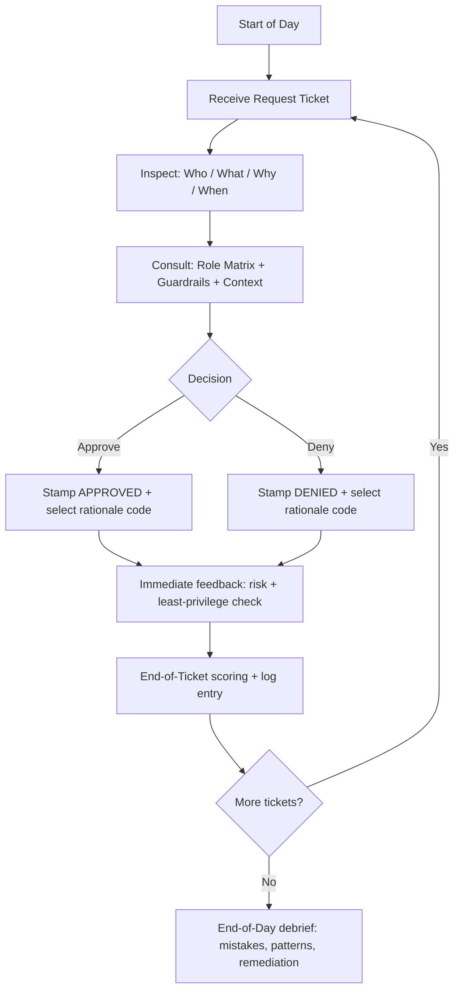

# IAM “Least Privilege” Gatekeeper  
*A Papers, Please–style web security training game (no game engine) focused on IAM decision-making, least privilege, and policy reasoning*

## Executive summary

“IAM ‘Least Privilege’ Gatekeeper” is a turn-based, document-inspection web game where the player acts as an access approver (“Gatekeeper”) who must **Approve** or **Deny** access requests using a simplified but realistic model of cloud authorization. The game’s pedagogical core is the **principle of least privilege**—grant only the access necessary to complete assigned tasks—formalized in widely used control frameworks (e.g., NIST SP 800-53 AC-6). citeturn0search8turn0search0  

A rigorous design should anchor decisions in an IAM-like logic: **implicit deny by default**, **explicit allow required**, and **explicit deny overrides allow**—mirroring how AWS describes policy evaluation outcomes. citeturn0search25turn0search29turn0search1 The game can progressively introduce modern access-control layers (RBAC → ABAC/tag-based policies → permission boundaries → organization guardrails via SCPs), reflecting that AWS effective permissions may be shaped by multiple policy types (identity policies, resource policies, permission boundaries, SCPs, and session policies). citeturn4search17turn3search2turn4search23  

From an implementation perspective, the project is well-suited to a small web stack (vanilla HTML/CSS/JS or React/Vue) with **data-driven scenarios** validated by **JSON Schema** (Draft 2020-12). citeturn5search0turn5search27 Accessibility should be treated as a first-class feature: all functionality keyboard-operable (WCAG 2.1.1), visible focus (WCAG 2.4.7), adequate contrast (WCAG 1.4.3), and sufficiently large interactive targets (WCAG 2.5.8). citeturn1search0turn1search1turn0search3turn1search3  

## Design foundations for a least-privilege training game

The game’s “rules of reality” should be explicit and consistent, so the player learns a repeatable mental model rather than memorizing trivia.

**Least privilege as the central doctrine.** NIST SP 800-53 AC-6 describes least privilege as allowing only authorized accesses necessary to accomplish assigned tasks. citeturn0search8turn0search0 In gameplay terms, every request must be judged against (a) the requester’s job-to-task scope, (b) the minimum actions/resources required, and (c) contextual constraints (environment, time window, ticket/approval chain).

**Separation of duties as a pressure valve.** The game becomes more interesting (and more realistic) when “doing the work” is intentionally separated from “granting broad authority.” NIST SP 800-53 AC-5 frames separation of duties as a way to reduce abuse of authorized privileges. citeturn2search8turn2search4 This supports scenarios like: developers can deploy to staging, but security approves production data access; auditors can read logs but cannot change configuration.

**Authorization reasoning should mimic real evaluation outcomes (simplified).** AWS policy evaluation outcomes include:
- **Implicit deny** (default) when no applicable allow exists  
- **Explicit deny** when an applicable deny exists and it overrides allows citeturn0search29turn0search25  
This maps cleanly to stamp-based play: the Gatekeeper should default to **Deny** unless an allow rule exists *and* no deny guardrail is triggered.

**Model “layers” of permission as the game advances.** AWS documents that permissions can come from multiple policy types, including identity-based policies, resource-based policies, permission boundaries, and AWS Organizations SCPs. citeturn4search17turn3search2turn4search23 This supports progressive difficulty: early levels use a simple role matrix; later levels introduce boundaries and organization guardrails that cap what identities can do.

## Core gameplay loop and mechanics

The “Papers, Please–style” feel comes from tight cycles: inspect → decide → consequences → escalate complexity. Below is a suggested loop optimized for clarity, learning transfer, and web implementation simplicity.



**Decision flow and turn structure.** Each “day” contains a fixed number of tickets (e.g., 6–10). Each ticket is a turn with:
1. **Request document** (the “passport”): identity, role, team, environment, requested action(s), resource(s), justification, ticket/incident ID, time window.
2. **Context panel**: system constraints (e.g., “Org SCP denies creating resources in us-west-1”), project timeline, security posture alerts.
3. **Rulebook**: role matrix and guardrails that update over progression.

This structure aligns with IAM’s reality that evaluation depends on request context and applicable policies. citeturn0search1turn0search25  

**Stamping UI mechanics.**
- Two large stamps: **APPROVE** and **DENY**, each keyboard-activatable.
- A required **rationale code** after stamping (e.g., “Allowed: dev-only read”, “Denied: prod data classification mismatch”, “Denied: missing ticket/justification”). This prevents “click through” behavior and generates analyzable learning telemetry.
- Optional “NOTES” scribble (free text) for roleplay, but scoring should rely on structured codes to avoid subjective grading.

**Keyboard-first interactions.** Every function should be operable through a keyboard interface (WCAG 2.1.1). citeturn1search0 Concretely:
- `Tab/Shift+Tab` cycles focus across the request fields, rulebook, stamps, and rationale dialog.
- `A` triggers Approve (with confirm), `D` triggers Deny.
- `Esc` closes modals and returns focus predictably (supported patterns are documented in WAI-ARIA Authoring Practices). citeturn1search2turn1search34  

**Error handling and “paperwork failure” states.** A security training game should treat incomplete information as a meaningful failure mode:
- If a request is missing required details (no resource ARN pattern, no justification, no time window for elevated access), the correct decision is usually **Deny (Incomplete request)** rather than guessing.
- The UI should surface validation errors *without* blocking the player from denying. (Blocking denial creates unrealistic incentives.)
- If the player tries to approve with missing mandatory fields, the game should interrupt with a brief explanation: “All requests are denied by default unless explicitly justified and scoped,” reinforcing implicit deny as the baseline. citeturn0search25turn0search29  

**Consequences tuned for learning (not punishment).**
- Immediate micro-feedback: “Approved too broad: wildcard resource would grant more than necessary.”
- End-of-day macro-feedback: trends like “You over-approved production data access” or “You denied legitimate dev read access,” tied to remediation lessons.

## Roles, access matrices, decision rules, and scenario catalog

This section defines: (a) role archetypes, (b) an access matrix, and (c) rigorous approve/deny logic with edge cases grounded in widely documented IAM concepts.

### Role definitions

Minimum set (per your request) plus a few “other unspecified roles” that create richer separation-of-duties gameplay:

- **Intern**: learning, low-risk tasks, strictly non-production data.
- **Developer**: builds services; needs dev/staging access; limited production visibility for debugging.
- **Admin (Break-glass)**: emergency-only privileged operations; approvals must be time-bound and auditable.
- **Security Engineer**: configures guardrails and monitors; should not be the person pushing app changes in-story (separation of duties).
- **Data Analyst**: read-only analytics/data access, ideally to sanitized datasets.
- **Auditor/Compliance**: read-only access to logs and evidence; cannot change resources.

### Base role-access matrix

The matrix below is intentionally simplified: it focuses on a few core AWS resource families you named (S3, EC2, RDS, IAM policies). Precise IAM actions differ by task; AWS’s Service Authorization Reference is the canonical list of service actions, resource types, and condition keys. citeturn3search4turn3search0turn3search1turn4search1  

**Legend:**  
R = read/describe/list; W = write/modify; P = provision/create; A = administer IAM/guardrails; ✳ = only with explicit ticket + time bound

| Role | S3 dev buckets (non-prod) | S3 prod sensitive buckets | EC2 dev | EC2 prod | RDS dev | RDS prod | IAM policies/roles |
|---|---|---|---|---|---|---|---|
| Intern | R (scoped) | Deny | R (limited) | Deny | R (sanitized) | Deny | Deny |
| Developer | R/W (team-scoped) | R (logs only, scoped) | P/R/W (tag-scoped) | R (describe + logs) | P/R/W (non-prod) | R (metrics/describe) | Deny (except very limited self-service) |
| Security Engineer | R (audit) | R (audit) | R (inventory) | R (inventory) | R (inventory) | R (inventory) | A (guardrails), no app deploy |
| Data Analyst | R (datasets) | R (approved datasets only) | Deny | Deny | R (analytics replicas) | R (read replicas; restricted) | Deny |
| Auditor/Compliance | R (logs/evidence) | R (logs/evidence) | R (inventory) | R (inventory) | R (inventory/metrics) | R (inventory/metrics) | Deny (read-only policy view optional) |
| Admin (Break-glass) | ✳ R/W/P | ✳ R/W/P | ✳ P/R/W | ✳ P/R/W | ✳ P/R/W | ✳ P/R/W | ✳ A (highest risk) |

**Why Admin is “✳” not “always allow.”** Least privilege doesn’t mean “some people have infinite access;” it means privileged access is **exceptional, scoped, and justified**. NIST least privilege (AC-6) and separation of duties (AC-5) support the game’s stance that Admin approvals require extra documentation and constraints. citeturn0search0turn2search4  

### ABAC overlay matrix (tag- and context-based constraints)

Add an ABAC overlay starting in mid-game. AWS describes ABAC as using attributes (in AWS, commonly **tags**) to define fine-grained permissions and reduce policy sprawl. citeturn4search3turn4search14turn4search22  

A simple overlay uses `env`, `team`, and `data_classification` tags:

| Constraint dimension | Example tag/key | Rule (teaching intent) |
|---|---|---|
| Environment scoping | `env` = `dev`/`staging`/`prod` | Interns cannot access `prod`; Developers limited to `prod` read-only logs; provisioning only in non-prod unless incident-approved |
| Team scoping | `team` = `payments`/`core` | Developers can act only on resources tagged with their team (prevents lateral privilege) |
| Data sensitivity | `data_classification` = `public`/`internal`/`confidential`/`restricted` | “restricted” (e.g., PII) requires explicit approval, time bound, and often a different role (Data Steward/Security) |
| Strong auth requirement | context requires MFA | Privileged actions require MFA condition (teaches “step-up auth” concepts; pairs well with break-glass narrative) |
| Region guardrail | `aws:RequestedRegion` | Prevent “oops” in wrong region; introduces org guardrails later (SCP) |

ABAC is especially useful in scenarios where the company scales quickly and creates many resources and teams—AWS explicitly calls out ABAC usefulness in scaling environments. citeturn4search3turn4search14  

### Clear approve/deny rules and edge cases

A robust rule system should be deterministic enough that players feel treated fairly.

**Core approval rule (RBAC+ABAC).** Approve only if all are true:
- The requester’s **role** allows the requested **action** on the **resource type**.
- The request is **minimally scoped** (no wildcard resources or actions unless the role explicitly requires it).
- The request includes required **context**: justification + ticket/incident ID where policy demands it.
- No **guardrail deny** is triggered (policy denies, boundary denies, org SCP denies).

This mirrors IAM’s principle that lack of a matching allow yields default deny, and any applicable deny overrides allows. citeturn0search25turn0search29  

**Edge case handling (teach the “gotchas”).**
- **Wildcard requests (`Action: *` or `Resource: *`)**: default Deny, unless the scenario is explicitly about break-glass Admin—and then require time-bound + incident ID.
- **iam:PassRole**: treat as a “high-risk hinge permission.” AWS documents PassRole as the mechanism for allowing a user to pass an IAM role to a service; done broadly, it can enable privilege escalation paths. citeturn3search32turn3search3 In game terms: PassRole approvals must be tightly resource-scoped to specific role ARNs and specific services.
- **Permission boundaries**: when introduced, teach that a permissions boundary sets the **maximum permissions** an identity-based policy can grant. citeturn3search2 If a request exceeds the boundary, Deny even if the role matrix “would have allowed it.”
- **Org SCP guardrails**: teach that SCPs provide central control over the **maximum available permissions** for IAM users/roles in an organization. citeturn4search23turn4search0 If an SCP blocks an action (e.g., restricting regions or disabling security services), Deny regardless of the requester’s role.
- **Resource-based policy surprise** (advanced): allow cross-account or principal-based access in a controlled scenario; teach that authorization can depend on both identity and resource policies in the evaluation chain. citeturn0search1turn0search21  

### Sample scenario table

At least 8 scenarios are required; the table below provides 10. These assume a fictional org with three environments (`dev`, `staging`, `prod`) and tag-based overlays.

| Scenario | Request (who / what) | Expected decision | Why (rule) | Teaching point |
|---|---|---|---|---|
| Dev onboarding | Intern requests `s3:ListBucket` + `s3:GetObject` on `s3://training-data-dev/*` | Approve | Non-prod, scoped dataset, role allows dev read | “Least privilege can still be enabling” |
| Curious intern | Intern requests `s3:GetObject` on `s3://prod-customer-pii/*` | Deny | Prod + restricted data mismatch | Data classification overrides curiosity |
| Debug logs | Developer requests read-only access to `s3://prod-app-logs/team=payments/*` for 2 hours with ticket | Approve | Prod access limited to logs, time-bound, team-scoped | “Prod read ≠ prod write” |
| Broad compute | Developer requests `ec2:RunInstances` in `prod` for “performance testing” | Deny | Provisioning in prod not in role; missing change window and controls | Separation of duties + environment guardrail |
| Staging deploy | Developer requests `ec2:RunInstances` in `staging` with tags `team=core` | Approve | Non-prod provisioning allowed if tag-scoped | Introduce tag scoping as ABAC |
| Snapshot panic | Data Analyst requests `rds:CreateDBSnapshot` on prod DB “to analyze later” | Deny | Write-like operation on prod DB, wrong role | Backups are operational; create separation |
| Evidence request | Auditor requests `cloudtrail:LookupEvents` + read-only S3 access to log archive bucket | Approve | Read-only evidence aligns with audit role | Audit ≠ admin; logs are sensitive but readable |
| PassRole trap | Developer requests `iam:PassRole` on `*` to “deploy faster” | Deny | PassRole must be scoped to specific role/service; wildcard is unacceptable | PassRole as escalation hinge citeturn3search32turn3search3 |
| Break-glass done right | Admin requests `iam:AttachRolePolicy` to hotfix role, includes incident ID, 30-min expiry | Approve | Break-glass permitted with strong governance | Privileged access must be exceptional |
| SCP surprise | Security Engineer requests to create resources in a blocked region; UI shows “Org SCP denies region” | Deny | SCP guardrail caps max permitted actions org-wide | “Guardrails beat local intent” citeturn4search23turn4search0 |

## Progressive difficulty, narrative beats, and character design

A security training game benefits from **progression that matches conceptual scaffolding**: start with clear RBAC, then add contextual constraints and exceptions.

**Difficulty curve proposal (acts/days).**
- **Act One: “The Manual”** (Days 1–3): Pure RBAC matrix; obvious mismatches; teaches implicit deny and minimal scoping.
- **Act Two: “The Real World”** (Days 4–7): Introduce ABAC tags (`env`, `team`, `data_classification`) and time windows; denial reasons become more nuanced. ABAC’s goal—dynamic authorization based on attributes—is explicitly described in AWS’s ABAC guidance. citeturn4search3turn4search14  
- **Act Three: “Guardrails”** (Days 8–11): Add permissions boundaries and org SCPs; players learn “even if your team wants it, guardrails can still deny it.” AWS describes permissions boundaries as an advanced feature that sets maximum permissions. citeturn3search2 AWS describes SCPs as centrally controlling maximum available permissions in an organization. citeturn4search23turn4search0  
- **Act Four: “Incidents and Exceptions”** (Days 12+): Break-glass access, PassRole traps, resource-policy quirks, and “request quality” as a first-class constraint.

**Narrative beats (Papers, Please flavor without copying).**
- The Gatekeeper is new; the company is scaling; mistakes have consequences (minor outages, audit findings, customer trust issues).
- Tickets arrive with human pressure: urgency, unclear language, office politics.
- The “rulebook” updates as the company matures (introducing ABAC, boundaries, SCPs, incident response).

**Character set (examples).**
- **Mina (Intern)**: earnest, sometimes overreaches; teaches “ask for sanitized datasets.”
- **Alex (Developer)**: pragmatic; will request broad permissions to ship fast; teaches scoping.
- **Jules (SRE/DevOps)**: wants operational access; teaches separation (ops vs dev vs security).
- **Priya (Security Engineer)**: introduces guardrails; teaches why “no” can be systemic.
- **Sam (Auditor)**: forces evidence discipline; teaches that read-only access can still be sensitive.

**Scenario writing principles.**
- Each scenario should have exactly one “best” stamp under the current rules, plus 1–2 plausible distractors.
- Every denial should offer a “what would make this approvable” hint (tighten scope, change role, use a different resource, add time window).

## Accessibility and UX requirements

Because the game is UI-dense and timing-based, accessibility must be designed in—not bolted on.

**Keyboard, focus, and interaction.**
- All functionality must be operable by keyboard (WCAG 2.1.1). citeturn1search0
- Focus must be visible for all interactive components (WCAG 2.4.7). citeturn1search1
- Avoid keyboard traps; modals (e.g., “Choose denial reason”) should follow established ARIA dialog patterns and manage focus predictably (APG guidance). citeturn1search2turn1search34  

**Color contrast and non-color cues.**
- Text contrast should meet WCAG 1.4.3 (Contrast Minimum). citeturn0search3
- Stamp outcomes must not rely on color alone; use icons, labels (“APPROVED”), and audible/screen reader announcements.

**Target size and pointer accessibility.**
- Stamps and critical buttons should meet WCAG 2.5.8 target size expectations (minimum target sizing/spacing). citeturn1search3turn1search19  

**Screen reader and semantic structure.**
- Prefer native HTML controls (buttons, inputs, details/summary) over div-based widgets; when custom UI is necessary (dragging stamps, “paper” overlays), ensure ARIA name/role/value is correct and updates are announced. The ARIA Authoring Practices Guide exists specifically to document accessible patterns for widgets and keyboard interaction. citeturn1search2  
- Use ARIA live regions sparingly for “Score +1” updates; prioritize meaningful announcements: “Denied. Reason: missing ticket.”

**Cognitive load management (critical for training transfer).**
- Keep each ticket’s required facts to 4–7 core fields; add complexity via *policy interactions* rather than dumping text.
- Use progressive disclosure: show one “Gotcha” per scenario (e.g., just ABAC tags, or just SCP), not three at once.
- Provide an always-available “Explain this decision” button after stamping—players learn best when feedback is immediate and specific.

## Technical architecture, data models, security, testing, localization, and UI mockups

This section focuses on building the game as a maintainable web application while keeping the scope modest.

### Technical stack options and tradeoffs

| Option | Strengths | Risks / costs | Best fit |
|---|---|---|---|
| Vanilla HTML/CSS/JS (ES modules) | Smallest footprint; easiest static hosting; great for deterministic state machines | You must design your own component/state patterns; scaling UI may get messy | MVP, prototypes, small teams |
| React | Strong ecosystem; predictable UI composition; mature testing tools | More tooling complexity; choices for state/i18n can sprawl | Medium/large content sets; future expansion |
| Vue | Good ergonomics; approachable; strong single-file component workflow | Ecosystem choices still exist; smaller hiring pool in some regions | Teams that prefer Vue patterns |
| Svelte | Very fast UI iteration; low boilerplate | Smaller ecosystem; fewer “standard” patterns for large apps | Highly interactive UI with small team |
| Server-rendered (Next/Nuxt) | Easier CSP and headers; can store progress securely | More moving parts; server costs | If you need accounts, analytics, or persistent progress |

Because hosting/auth are “no constraint,” you can start static and upgrade later.

### Client-only vs server components

A practical approach is to keep the **core game deterministic and client-executable**, while making persistence optional.

**Client-only (static)**
- Store progress in `localStorage`/IndexedDB.
- No user accounts required.
- Lowest privacy risk (no data leaves device).

**Server-backed (optional)**
- Store progress, scoring history, and training completion.
- Enables cohorts/leaderboards and training compliance reporting.
- Requires secure auth and data protection (see below).

### Data-driven scenarios and schemas

Scenario authoring is the key to replayability. Treat scenarios as content, not code.

**Recommended content model**
- `roles.json` defines roles, allowed action categories, overlays.
- `scenarios/*.json` defines each ticket, expected decision, teaching point.
- A small “policy reasoning engine” evaluates whether a request should be approved under current rules; this prevents content drift (writers accidentally specify impossible outcomes).

**JSON Schema as validation backbone.** JSON Schema is a standard for defining and validating JSON structure; the JSON Schema project identifies 2020-12 as the current version and publishes Core/Validation specs. citeturn5search0turn5search27  

#### Example JSON Schema: scenario data

```json
{
  "$schema": "https://json-schema.org/draft/2020-12/schema",
  "$id": "https://example.com/schemas/iam-gatekeeper/scenario.schema.json",
  "title": "IAM Gatekeeper Scenario",
  "type": "object",
  "required": ["id", "day", "title", "request", "expected", "teachingPoint"],
  "properties": {
    "id": { "type": "string", "pattern": "^[a-z0-9-]+$" },
    "day": { "type": "integer", "minimum": 1 },
    "title": { "type": "string", "minLength": 3 },
    "difficulty": { "type": "integer", "minimum": 1, "maximum": 10 },

    "request": {
      "type": "object",
      "required": ["requester", "actions", "resources", "justification"],
      "properties": {
        "requester": {
          "type": "object",
          "required": ["name", "role", "team"],
          "properties": {
            "name": { "type": "string" },
            "role": { "type": "string" },
            "team": { "type": "string" },
            "attributes": {
              "type": "object",
              "additionalProperties": { "type": ["string", "number", "boolean"] }
            }
          }
        },
        "environment": { "type": "string", "enum": ["dev", "staging", "prod"] },
        "actions": { "type": "array", "items": { "type": "string" }, "minItems": 1 },
        "resources": {
          "type": "array",
          "items": { "type": "string" },
          "minItems": 1
        },
        "justification": { "type": "string", "minLength": 10 },
        "ticketId": { "type": "string" },
        "timeWindowMinutes": { "type": "integer", "minimum": 0 },
        "constraints": {
          "type": "object",
          "properties": {
            "requiresMfa": { "type": "boolean" },
            "dataClassification": {
              "type": "string",
              "enum": ["public", "internal", "confidential", "restricted"]
            }
          },
          "additionalProperties": false
        }
      },
      "additionalProperties": false
    },

    "expected": {
      "type": "object",
      "required": ["decision", "reasonCode"],
      "properties": {
        "decision": { "type": "string", "enum": ["APPROVE", "DENY"] },
        "reasonCode": { "type": "string" },
        "explanation": { "type": "string" }
      },
      "additionalProperties": false
    },

    "teachingPoint": { "type": "string", "minLength": 10 }
  },
  "additionalProperties": false
}
```

This schema design is grounded in the intent of JSON Schema to define structure and validation rules for JSON documents. citeturn5search27turn5search0  

#### Example JSON Schema: scoring event

```json
{
  "$schema": "https://json-schema.org/draft/2020-12/schema",
  "$id": "https://example.com/schemas/iam-gatekeeper/score-event.schema.json",
  "title": "IAM Gatekeeper Score Event",
  "type": "object",
  "required": ["scenarioId", "timestamp", "decision", "isCorrect", "scoreDelta"],
  "properties": {
    "scenarioId": { "type": "string" },
    "timestamp": { "type": "string", "format": "date-time" },
    "decision": { "type": "string", "enum": ["APPROVE", "DENY"] },
    "reasonCode": { "type": "string" },
    "isCorrect": { "type": "boolean" },
    "scoreDelta": { "type": "integer" },
    "tags": {
      "type": "object",
      "additionalProperties": { "type": "string" }
    }
  },
  "additionalProperties": false
}
```

### Scoring, feedback, and assessment metrics

The goal is not “speed runs,” but correct reasoning under realistic constraints.

**Scoring model (suggested).**
- +10 correct decision (approve/deny matches expected).
- −15 for dangerous false approvals (e.g., approving prod restricted data).
- −5 for false denials (blocking legitimate work).
- +0 to +3 for selecting the best rationale code (encourages articulated reasoning).
- Optional time pressure: small bonus for timely decisions, but never so large that it incentivizes guessing.

**Learning analytics (useful even client-only).**
- Accuracy by concept: ABAC tag errors, wildcard over-approval, PassRole misunderstanding, guardrail misunderstanding.
- Time-to-decision as a proxy for cognitive load (watch for spikes after introducing SCPs/boundaries).

These concepts are consistent with the need to understand layered guardrails and evaluation chains in real permission systems (e.g., guardrails at org level, boundaries at identity level). citeturn4search19turn3search2turn4search23  

### Security and privacy considerations for the web app itself

Even though the game is about security, the application must also be secure.

**Baseline web security controls.**
- Protect against injection classes and unsafe dynamic rendering patterns; OWASP Top 10 highlights injection as a major class of app weakness when user input is not validated/escaped. citeturn2search1turn2search9  
- Use a **Content Security Policy (CSP)** to reduce XSS risk; MDN describes CSP as a way to restrict what resources a page may load, and OWASP provides guidance on CSP as defense-in-depth. citeturn2search3turn2search19  

**If you add accounts / server storage.**
- Treat progress as user data; minimize collection.
- Use a recognized verification baseline such as OWASP ASVS (the ASVS project provides structured security requirements for web apps). citeturn2search2  

### Testing and QA plan

A lightweight but rigorous plan aligns with the game’s “rules engine + content” structure:

- **Unit tests** for the decision engine: given a role, request, and guardrails, assert expected allow/deny (especially for deny-overrides logic). AWS explicitly documents deny-vs-allow interplay, so your engine should replicate the simplified version consistently. citeturn0search29turn0search25  
- **Content validation tests**: every scenario JSON validates against schema; every scenario has an unambiguous expected outcome.
- **Accessibility tests**:
  - Keyboard-only walkthroughs (WCAG 2.1.1). citeturn1search0  
  - Visible focus checks (WCAG 2.4.7). citeturn1search1  
  - Contrast checks (WCAG 1.4.3). citeturn0search3  
  - Target size checks (WCAG 2.5.8). citeturn1search3  
- **End-to-end tests**: simulate “day playthrough” flows (approve/deny, reason selection, debrief).
- **Playtesting**: verify that each scenario teaches exactly one main concept and that feedback is understandable.

### Localization and content authoring workflow

To scale beyond en-US, design string handling early.

**Internationalization (i18n) approach.**
- Externalize all user-visible strings with stable message IDs; never concatenate sentence fragments (translation quality suffers).
- Consider ICU MessageFormat-style strings for plurals/gender/formatting; ICU is a widely used Unicode/globalization library set and documents MessageFormat usage patterns. citeturn5search2  
- Use locale data from a standard source such as Unicode CLDR, described as a major repository of locale data used for internationalization/localization tasks. citeturn5search1turn5search24  

**Content authoring workflow (practical).**
- Writers create scenarios in JSON/YAML via a simple editor (even a spreadsheet export is fine if you validate to JSON).
- A CI step validates schemas, checks for missing translations, and runs “scenario solvability” tests.
- Translation workflow: export strings; import translations; run pseudo-localization checks (text expansion, RTL if needed).

### Minimal asset list and UI mockup suggestions

You can achieve strong “desk paperwork” vibes with very few assets:

**Minimal asset list.**
- 1 background (“desk” texture) + 1 paper template (request form)
- 2 stamp graphics (Approve/Deny) + 1 inked “error” stamp (optional)
- 6 character portraits (simple silhouettes work)
- 12–20 small icons (S3 bucket, EC2 instance, DB cylinder, shield/log)
- 2–3 UI sound effects (stamp thud, paper shuffle) (optional—must be disableable)

**Wireframe layout suggestion (single-screen play).**

```mermaid
flowchart LR
  subgraph Left[Request Document]
    A1[Requester + Role + Team]
    A2[Requested Actions]
    A3[Resources / ARNs]
    A4[Justification + Ticket + Time Window]
  end

  subgraph Right[Rulebook & Context]
    B1[Role Matrix]
    B2[ABAC Tag Rules]
    B3[Guardrails: Boundary / SCP (later)]
    B4[Hints / Glossary]
  end

  subgraph Bottom[Decision Bar]
    C1[APPROVE Stamp]
    C2[DENY Stamp]
    C3[Rationale Code Picker]
    C4[Undo / Next Ticket]
  end

  Left --> Bottom
  Right --> Bottom
```

To support accessibility, keep stamps as real `<button>` elements (not canvas-only), ensure focus styles are visible, and ensure target sizes are adequate—all directly aligned with WCAG keyboard operability, focus visibility, and target size guidance. citeturn1search0turn1search1turn1search3